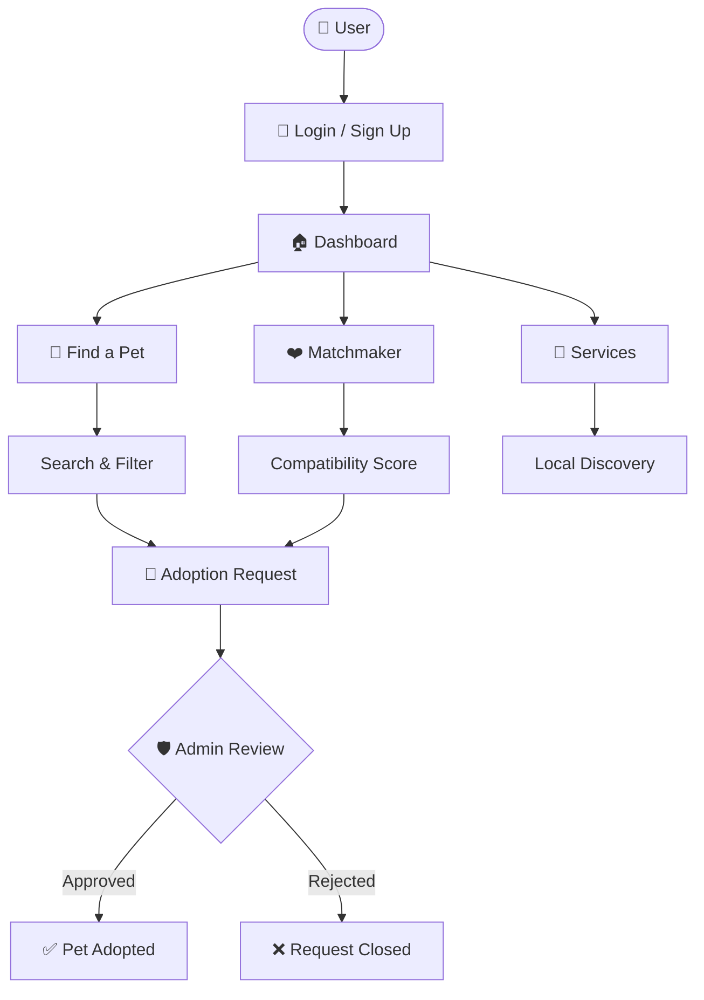
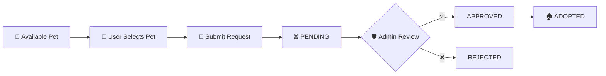
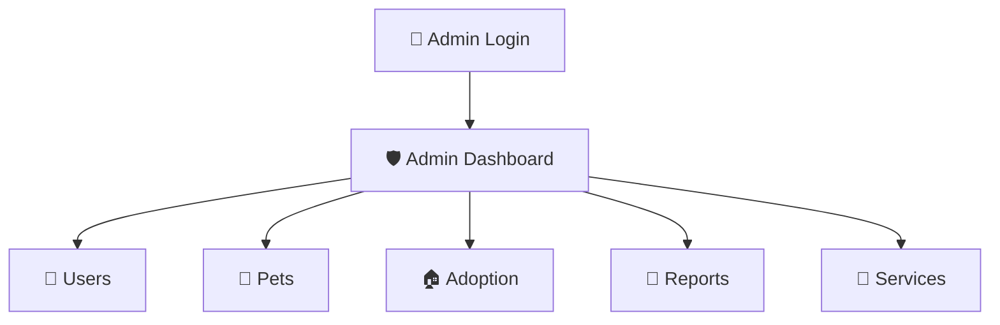
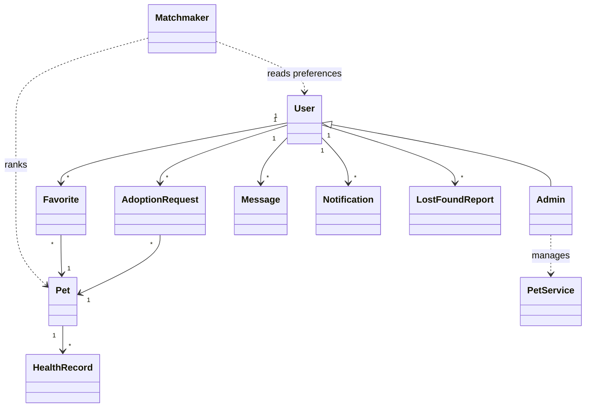
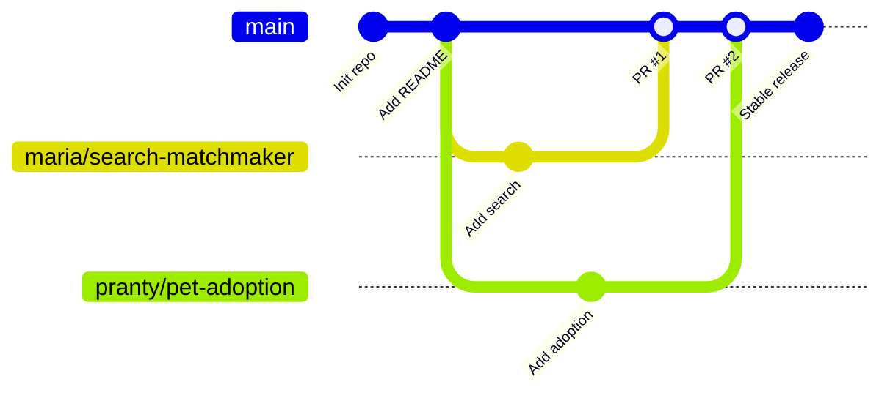

<div align="center">

# 🐾 Local Pet Care & Adoption Matchmaker

### *Find the right pet. Build a better bond. Care locally.*

<p>
A modular <b>C++</b> application combining <b>Pet Adoption</b>, <b>Pet Care</b>, <b>Smart Matchmaking</b>, <b>Lost &amp; Found</b>, and <b>Local Pet Services</b> into one integrated platform.
</p>

<p>


</p>

<p>


</p>

**🐶 Discover → 🔎 Search → ❤️ Match → 🏠 Adopt → 💉 Care → 💬 Connect**

</div>

---

## 📑 Table of Contents

| # | Section | # | Section |
|:-:|:--|:-:|:--|
| 1 | [🌟 Project at a Glance](#-project-at-a-glance) | 12 | [💬 Messaging & 🔔 Notifications](#-messaging--notifications) |
| 2 | [🚀 Getting Started](#-getting-started) | 13 | [🛡️ Admin Panel](#️-admin-panel) |
| 3 | [🧭 System Architecture](#-system-architecture) | 14 | [📁 Data & File Storage](#-data--file-storage) |
| 4 | [👥 Team & Responsibilities](#-team--responsibilities) | 15 | [🧱 Object-Oriented Design](#-object-oriented-design) |
| 5 | [✨ Core Features](#-core-features) | 16 | [📂 Project Structure](#-project-structure) |
| 6 | [❤️ Smart Matchmaker Engine](#️-smart-matchmaker-engine) | 17 | [🔀 Git & GitHub Workflow](#-git--github-workflow) |
| 7 | [🏠 Adoption Workflow](#-adoption-workflow) | 18 | [🔒 Team Rules & Standards](#-team-rules--standards) |
| 8 | [🏷️ Status & ID Conventions](#️-status--id-conventions) | 19 | [🧪 Testing & Error Handling](#-testing--error-handling) |
| 9 | [📍 Lost & Found](#-lost--found) | 20 | [🎓 10% Demonstration Milestone](#-10-demonstration-milestone) |
| 10 | [🏪 Pet Services Directory](#-pet-services-directory) | 21 | [🗺️ Development Roadmap](#️-development-roadmap) |
| 11 | [💉 Pet Health Care](#-pet-health-care) | 22 | [🤝 Contributing · 📜 License](#-contributing) |

---

## 🌟 Project at a Glance

**Local Pet Care & Adoption Matchmaker** is a team-developed C++ application that makes pet adoption and pet care more **organized**, **personalized**, and **accessible**.

| Aspect | Details |
|:--|:--|
| 🎯 **Goal** | Bring adoption, matchmaking, care, and local pet services into a single platform |
| 💻 **Language** | C++ (C++17 recommended) |
| 🖥️ **Interface** | Console / menu-driven |
| 💾 **Storage** | Plain-text files with `\|` field separators |
| 🧱 **Design** | Object-Oriented, modular, one module per team member |
| 🔀 **Collaboration** | Git & GitHub with feature-branch workflow and Pull Requests |

### 🎓 Learning Outcomes

| Area | What the project demonstrates |
|:--|:--|
| 🧱 OOP | Classes, encapsulation, inheritance, polymorphism |
| ⚙️ Algorithms | Searching, filtering, weighted scoring, sorting/ranking |
| 📁 File Handling | Persistent read/write of structured data |
| 🏗️ Architecture | Modular design and multi-module integration |
| 🔀 Teamwork | Branching, commits, code review, conflict resolution |

---

## 🚀 Getting Started

### ✅ Prerequisites

| Tool | Version | Purpose |
|:--|:--|:--|
| `g++` / `clang++` | C++17 support | Compile the project |
| `git` | Any recent version | Version control |
| VS Code / CLion / Code::Blocks | Optional | Development environment |

### 📥 Clone the Repository

```bash
git clone https://github.com/<your-org>/Local-Pet-Care-Adoption-Matchmaker.git
cd Local-Pet-Care-Adoption-Matchmaker
```

### 🔨 Build

```bash
# Linux / macOS
g++ -std=c++17 -Iinclude src/*.cpp src/*/*.cpp -o petmatch

# Windows (MinGW)
g++ -std=c++17 -Iinclude src/*.cpp src/*/*.cpp -o petmatch.exe
```

### ▶️ Run

```bash
./petmatch          # Linux / macOS
petmatch.exe        # Windows
```

> 💡 **Note:** Run the program from the project root so it can find the `data/` folder.

---

## 🧭 System Architecture

```text
                         ┌─────────────────────────────────────┐
                         │        🐾 PET MATCHMAKER APP        │
                         │       Local Pet Care Platform       │
                         └──────────────────┬──────────────────┘
                                            │
                    ┌───────────────────────┴───────────────────────┐
                    │                                               │
          ┌─────────▼──────────┐                         ┌──────────▼─────────┐
          │ 🔐 AUTHENTICATION  │                         │    🏠 DASHBOARD    │
          │  Register / Login  │                         │    User / Admin    │
          └─────────┬──────────┘                         └──────────┬─────────┘
                    └───────────────────────┬───────────────────────┘
                                            │
     ┌──────────────────┬───────────────────┼───────────────────┬──────────────────┐
     ▼                  ▼                   ▼                   ▼                  ▼
┌──────────────┐ ┌──────────────┐  ┌──────────────┐  ┌──────────────┐  ┌──────────────┐
│ 🔎 DISCOVERY │ │ 🏠 ADOPTION  │  │ ❤️ MATCHMAKER│  │ 🐾 PET CARE  │  │ 💬 COMMUNITY │
│ Search       │ │ Pet Mgmt     │  │ Score        │  │ Health       │  │ Messaging    │
│ Filter       │ │ Requests     │  │ Ranking      │  │ Vaccination  │  │ Notifications│
│ Favorites    │ │ Status       │  │ Match %      │  │ Records      │  │ Local Links  │
└──────┬───────┘ └──────┬───────┘  └──────┬───────┘  └──────┬───────┘  └──────┬───────┘
       └────────────────┴─────────────────┼─────────────────┴─────────────────┘
                                          │
                                 ┌────────▼────────┐
                                 │  📁 DATA LAYER  │
                                 │  File Handling  │
                                 │  Read / Write   │
                                 └────────┬────────┘
                                          │
                                 ┌────────▼────────┐
                                 │ 🛡️ ADMIN PANEL  │
                                 │ Users · Pets    │
                                 │ Requests        │
                                 │ Reports         │
                                 │ Services        │
                                 └─────────────────┘
```

### 🔗 High-Level User Flow



---

## 👥 Team & Responsibilities

| Member | Core Modules | Main Focus | Branch |
|:--|:--|:--|:--|
| 👩‍💻 **Maria** | 🔎 Search & Filter · ⭐ Favorites · ❤️ Matchmaker | Discovery & recommendation | `maria/search-matchmaker` |
| 👩‍💻 **Pranty** | 🏠 Adoption · 🐾 Pet Management | Pet listings & adoption flow | `pranty/pet-adoption` |
| 👩‍💻 **Jannat** | 📍 Lost & Found · 🏪 Pet Services | Local pet community | `jannat/lost-found-services` |
| 👨‍💻 **Maruf** | 💉 Health Care · 💬 Messaging · 🛡️ Admin | Care, communication & management | `maruf/health-messaging-admin` |
| 👩‍💻 **Megha** | 🔐 Authentication · 📁 File Handling · 📍 Local Discovery · 🔔 Notifications · 🏠 Dashboard · 🔗 Integration | Data, access & final integration | `megha/auth-file-notification` |

> 🤝 **Team Principle:** Each member owns their module, but the final product is **one integrated application**.

---

## ✨ Core Features

| Module | Features | Owner |
|:--|:--|:--|
| 🔐 **Authentication** | Registration · Login · User roles · Profile access | Megha |
| 🔎 **Search & Filter** | Species · Breed · Age · Gender · Location · Adoption status | Maria |
| ⭐ **Favorites** | Add pets · Remove pets · View saved pets | Maria |
| ❤️ **Smart Matchmaker** | Compatibility scoring · Preference-based matching · Ranked recommendations | Maria |
| 🐾 **Pet Management** | Add · View · Update · Remove pet listings | Pranty |
| 🏠 **Adoption** | Adoption requests · Request tracking · Admin approval · Status updates | Pranty |
| 📍 **Lost & Found** | Report lost pets · Report found pets · View reports · Resolution status | Jannat |
| 🏪 **Pet Services** | Vets · Grooming · Boarding · Training · Pet shops · Food providers | Jannat |
| 💉 **Pet Health** | Vaccination records · Medical notes · Medication · Due-date tracking | Maruf |
| 💬 **Messaging** | Sender / receiver · Basic messaging · Stored conversations | Maruf |
| 🛡️ **Admin Panel** | User · Pet · Adoption · Report · Service management | Maruf |
| 🔔 **Notifications** | Approvals · New messages · Vaccine reminders · System alerts | Megha |
| 🏠 **Dashboard** | Central user / admin menu linking every module | Megha |

---

## ❤️ Smart Matchmaker Engine

The **Matchmaker Engine** is the project's main highlight. It compares user preferences against pet characteristics, calculates a **weighted compatibility score**, and ranks pets from best to least compatible.

### ⚖️ Scoring Model

| Criteria | Weight | Example Rule |
|:--|:-:|:--|
| 🐕 Species Compatibility | **30%** | Exact match = full points |
| 🎂 Age Compatibility | **15%** | Within preferred age range |
| 📍 Location | **15%** | Same area = full, nearby = partial |
| 📏 Size | **10%** | Matches preferred size |
| ⚡ Activity Level | **10%** | Matches user lifestyle |
| 🏡 Living Environment | **10%** | Apartment / house / yard suitability |
| ➕ Other Preferences | **10%** | Gender, breed, temperament, etc. |
| | **100%** | **Total** |

### 🧮 Formula

```text
Match % = Σ (criterion_score × criterion_weight)      where criterion_score ∈ [0, 1]
```

### 🏆 Example Result

```text
╔══════════════════════════════════╗
║        ❤️ YOUR BEST MATCHES      ║
╠══════════════════════════════════╣
║   🥇  Bruno   →  95% Match       ║
║   🥈  Rocky   →  84% Match       ║
║   🥉  Max     →  76% Match       ║
╚══════════════════════════════════╝
```

> 📌 Recommendations are always sorted **from highest to lowest** compatibility.

---

## 🏠 Adoption Workflow



---

## 🏷️ Status & ID Conventions

### 📊 Standard Status Values

| Status | Used In | Meaning |
|:--|:--|:--|
| 🟢 `Available` | Pets | Open for adoption |
| 🟡 `Pending` | Adoption | Request submitted, awaiting review |
| 🔵 `Approved` | Adoption | Request accepted by admin |
| 🔴 `Rejected` | Adoption | Request declined by admin |
| 🏠 `Adopted` | Pets | Pet has a new home |
| 🚨 `Lost` | Lost & Found | Pet reported missing |
| 🔍 `Found` | Lost & Found | Pet reported found |
| ✅ `Resolved` | Lost & Found | Case closed |

### 🆔 ID Conventions

| Entity | Field | Prefix | Example |
|:--|:--|:-:|:-:|
| User | `userID` | `U` | `U001` |
| Pet | `petID` | `P` | `P001` |
| Adoption | `adoptionID` | `A` | `A001` |
| Message | `messageID` | `M` | `M001` |
| Lost/Found Report | `reportID` | `R` | `R001` |
| Service | `serviceID` | `S` | `S001` |
| Notification | `notificationID` | `N` | `N001` |
| Health Record | `healthID` | `H` | `H001` |
| Favorite | `favoriteID` | `F` | `F001` |

> ⚠️ Status values and ID formats are **case-sensitive** and shared by all modules. Do not invent new ones without team agreement.

---

## 📍 Lost & Found

Users can report missing or found pets using structured information.

| Field | Description |
|:--|:--|
| `reportID` | Unique report ID (e.g. `R001`) |
| `petName` | Pet's name (or `Unknown`) |
| `species` / `breed` | Type and breed |
| `location` | Last seen / found location |
| `date` | Date of report (`DD/MM/YYYY`) |
| `description` | Colour, markings, collar, etc. |
| `contact` | Reporter's contact information |
| `status` | `Lost` · `Found` · `Resolved` |

> 🔮 **Future Enhancement — Lost & Found Matching Score:** compare **Species + Breed + Location + Appearance + Date** to automatically suggest possible matches between lost and found reports.

---

## 🏪 Pet Services Directory

| Service Type | Icon | Field | Description |
|:--|:-:|:--|:--|
| Veterinary Clinics | 🩺 | `serviceID` | Unique ID (e.g. `S001`) |
| Pet Shops | 🛍️ | `serviceName` | Business name |
| Grooming | ✂️ | `serviceType` | One of the types listed |
| Boarding | 🏨 | `location` | Area / address |
| Training | 🎓 | `contact` | Phone / email |
| Food Providers | 🍖 | `description` | Short summary |

---

## 💉 Pet Health Care

| Field | Description |
|:--|:--|
| `petID` | Linked pet |
| `vaccine` | Vaccine name |
| `vaccinationDate` | Date given |
| `nextDueDate` | Next dose due |
| `medicalNotes` | Observations / conditions |
| `medication` | Current medication |
| `vetInfo` | Veterinary clinic / doctor |

```text
┌──────────────────────────────┐
│  💉 HEALTH RECORD            │
├──────────────────────────────┤
│  Pet       : Bruno (P001)    │
│  Vaccine   : Rabies          │
│  Date      : 10/05/2026      │
│  Next Due  : 10/05/2027      │
└──────────────────────────────┘
```

---

## 💬 Messaging & 🔔 Notifications

<table>
<tr>
<td width="50%" valign="top">

### 💬 Messaging

| Field | Example |
|:--|:--|
| `messageID` | `M001` |
| `senderID` | `U101` |
| `receiverID` | `U205` |
| `message` | *Is Bruno still available?* |
| `timestamp` | `07/10/2026 14:30` |

</td>
<td width="50%" valign="top">

### 🔔 Notifications

| Trigger | Example |
|:--|:--|
| ✅ Adoption | Request approved |
| 💬 Message | New message received |
| 💉 Health | Vaccination reminder |
| 📍 Lost & Found | Report updated |
| 📢 System | Announcement |

</td>
</tr>
</table>

---

## 🛡️ Admin Panel



| Responsibility | Action |
|:--|:--|
| 👤 Manage users | View · Edit · Remove |
| 🐾 Manage pet listings | Add · Update · Remove |
| 🏠 Review adoption requests | Approve · Reject |
| 📍 Manage lost & found | Update status · Resolve |
| 🏪 Manage services | Add · Update · Remove |
| 📊 System information | Counts of users, pets, requests, reports |

---

## 📁 Data & File Storage

All data is stored in plain-text files using `|` as the field separator.

| File | Record Format | Example |
|:--|:--|:--|
| `users.txt` | `userID\|name\|email\|password\|role\|location` | `U001\|Maruf\|maruf@mail.com\|****\|Admin\|Dhaka` |
| `pets.txt` | `petID\|name\|species\|breed\|age\|gender\|location\|status` | `P001\|Bruno\|Dog\|Labrador\|3\|Male\|Dhaka\|Available` |
| `favorites.txt` | `userID\|petID` | `U002\|P001` |
| `adoption.txt` | `adoptionID\|userID\|petID\|date\|status` | `A001\|U002\|P001\|07/10/2026\|Pending` |
| `lost_found.txt` | `reportID\|petName\|species\|breed\|location\|date\|description\|contact\|status` | `R001\|Kitty\|Cat\|Persian\|Uttara\|05/10/2026\|White, blue collar\|017XXXXXXXX\|Lost` |
| `services.txt` | `serviceID\|name\|type\|location\|contact\|description` | `S001\|PawCare\|Vet\|Dhanmondi\|018XXXXXXXX\|24/7 clinic` |
| `health.txt` | `healthID\|petID\|vaccine\|date\|nextDue\|notes\|medication\|vet` | `H001\|P001\|Rabies\|10/05/2026\|10/05/2027\|Healthy\|None\|PawCare` |
| `messages.txt` | `messageID\|senderID\|receiverID\|message\|timestamp` | `M001\|U101\|U205\|Is Bruno available?\|07/10/2026 14:30` |
| `notifications.txt` | `notificationID\|userID\|message\|date\|isRead` | `N001\|U002\|Adoption approved\|07/10/2026\|0` |

> ⚠️ **Data Rules**
> - Never use the `|` character inside a field value.
> - Dates use `DD/MM/YYYY` everywhere.
> - Any change to a file format must be agreed by the whole team and updated here first.
> - Passwords should be hashed or at least masked; never commit real credentials.

---

## 🧱 Object-Oriented Design

### 📦 Core Classes

| Class | Responsibility | Key Relationships |
|:--|:--|:--|
| `User` | Base account data & login | Parent of `Admin` |
| `Admin` | Management operations | Inherits `User` |
| `Pet` | Pet profile & status | Used by most modules |
| `AdoptionRequest` | Request lifecycle | Links `User` ↔ `Pet` |
| `Favorite` | Saved pets | Links `User` ↔ `Pet` |
| `LostFoundReport` | Lost/found cases | Owned by `User` |
| `PetService` | Service listing | Managed by `Admin` |
| `HealthRecord` | Vaccines & medical data | Belongs to `Pet` |
| `Message` | User-to-user communication | Links two `User`s |
| `Notification` | System alerts | Sent to `User` |
| `Matchmaker` | Scoring & ranking | Reads `User` prefs + `Pet` list |
| `FileManager` | Read / write data files | Used by every module |

### 🔗 Class Relationships



### 🧩 Design Principles

| Principle | Application in This Project |
|:--|:--|
| 🔒 Encapsulation | Private data members with getters/setters in every class |
| 🎭 Abstraction | `FileManager` hides file I/O details from modules |
| 🧬 Inheritance | `Admin` extends `User` |
| 🔄 Polymorphism | Virtual `displayMenu()` for user vs. admin dashboards |
| 🧱 Modularity | One folder per feature module |
| ♻️ Reusability | Shared helpers for splitting lines and generating IDs |
| 🛠️ Maintainability | Consistent naming, formatting, and comments |

> The final class structure may evolve during implementation.

---

## 📂 Project Structure

```text
Local-Pet-Care-Adoption-Matchmaker/
│
├── 📄 README.md
├── 📄 .gitignore
├── 📄 LICENSE
│
├── 📁 include/            # Header files (.h)
│
├── 📁 src/
│   ├── main.cpp           # Application entry point
│   ├── user/              # 🔐 Authentication & users
│   ├── pet/               # 🐾 Pet management
│   ├── search/            # 🔎 Search, filter, favorites
│   ├── matchmaker/        # ❤️ Compatibility engine
│   ├── adoption/          # 🏠 Adoption requests
│   ├── lost_found/        # 📍 Lost & found
│   ├── services/          # 🏪 Service directory
│   ├── health/            # 💉 Health records
│   ├── messaging/         # 💬 Messaging
│   ├── notification/      # 🔔 Notifications
│   ├── admin/             # 🛡️ Admin panel
│   └── utils/             # 📁 FileManager & shared helpers
│
├── 📁 data/               # 💾 Persistent .txt storage
│
├── 📁 docs/
│   ├── architecture.md
│   ├── database-design.md
│   └── diagrams/
│
└── 📁 tests/              # 🧪 Module test cases
```

> Avoid creating empty files just for appearance; add them when the module is implemented.

---

## 🔀 Git & GitHub Workflow



### 🛠️ Step-by-Step

| Step | Action | Command |
|:-:|:--|:--|
| 1️⃣ | Update `main` | `git checkout main` → `git pull origin main` |
| 2️⃣ | Create / switch branch | `git checkout -b maruf/health-messaging-admin` |
| 3️⃣ | Sync with latest `main` | `git merge main` |
| 4️⃣ | Stage changes | `git add <files>` |
| 5️⃣ | Commit | `git commit -m "Add vaccination record management"` |
| 6️⃣ | Push | `git push origin maruf/health-messaging-admin` |
| 7️⃣ | Open a Pull Request | GitHub → **Compare & pull request** |
| 8️⃣ | Review → Approve → Merge | At least **one teammate** reviews before merging |

### 📝 Commit Message Style

| ✅ Good | ❌ Avoid |
|:--|:--|
| `Add pet search functionality` | `update` |
| `Implement compatibility scoring` | `final` |
| `Add adoption request system` | `test` |
| `Create user registration and login` | `new` |
| `Add vaccination record management` | `changes` |
| `Fix crash on empty pets.txt` | `asdf` |

> 💡 Start with a verb (**Add**, **Fix**, **Update**, **Refactor**, **Remove**) and describe *what* changed.

---

## 🔒 Team Rules & Standards

> **`main` = stable code** · **feature branches = active development**

| Category | ✅ Do | 🚫 Don't |
|:--|:--|:--|
| 🌿 **Branching** | One feature → one branch | Develop directly on `main` |
| 🔄 **Syncing** | Pull latest `main` before major work | Work on an outdated branch for days |
| 💾 **Commits** | Small, meaningful commits | Commit unrelated or generated files |
| 🧪 **Quality** | Test before pushing; keep `main` buildable | Push code that doesn't compile |
| 👀 **Review** | Review every PR before merging | Merge your own PR without review |
| 🤝 **Respect** | Resolve conflicts carefully | Overwrite another member's work |
| 📁 **Data** | Use shared IDs, statuses, and formats | Change a file format alone |
| 🧠 **Ownership** | Understand every line you submit | Submit code you can't explain |

### 🧑‍💻 Coding Standards

| Rule | Example |
|:--|:--|
| Classes in `PascalCase` | `AdoptionRequest` |
| Functions & variables in `camelCase` | `calculateScore()`, `petList` |
| Constants in `UPPER_SNAKE_CASE` | `MAX_PETS` |
| Files in `snake_case` | `lost_found.cpp` |
| Keep functions short and focused | One task per function |
| Comment important algorithms | Especially the matchmaker scoring |
| `main.cpp` is the only entry point | No extra `main()` functions in modules |

---

## 🧪 Testing & Error Handling

### ✔️ Test Areas

| Area | What to Verify |
|:--|:--|
| ✅ Valid input | Correct output for normal data |
| ❌ Invalid input | Clear error message, no crash |
| ⬜ Empty input | Handled gracefully |
| 📁 File I/O | Data saved and reloaded correctly |
| 🔎 Search | Correct pets returned |
| 🏠 Adoption | Status changes correctly |
| ❤️ Matchmaker | Scores calculated and sorted correctly |
| 🔐 Authentication | Valid / invalid login |
| 💬 Messaging | Messages stored and displayed |
| 🔗 Integration | Modules work together through the dashboard |

### 🧾 Example Test Case

| Test ID | Input | Expected Output | Result |
|:-:|:--|:--|:-:|
| `T001` | Search → `Dog` | All available dogs are displayed | ⬜ |
| `T002` | Login with wrong password | `Invalid username or password.` | ⬜ |
| `T003` | Adopt pet `P999` | `Pet ID not found.` | ⬜ |

### ⚠️ Handled Errors

| Error | User Message |
|:--|:--|
| Invalid login | *Invalid username or password.* |
| Pet / User ID not found | *No record found for the given ID.* |
| Invalid menu choice | *Please choose a valid option.* |
| File not found | *Data file missing — a new one will be created.* |
| No search results | *No pets match your search.* |
| Invalid adoption request | *This pet is not available for adoption.* |
| Invalid input format | *Invalid input. Please try again.* |

---

## 🎓 10% Demonstration Milestone

The first demo shows a **small but working slice** of every module:

```text
   📥 INPUT   ──►   ⚙️ PROCESSING   ──►   📤 OUTPUT
```

**Every feature must:** ✅ Compile · ✅ Accept input · ✅ Process it · ✅ Produce meaningful output · ✅ Be committed by its owner · ✅ Be explainable by its owner

| Member | Module | 10% Target | Done |
|:--|:--|:--|:-:|
| 👩‍💻 **Maria** | 🔎 Search & Filter | Search pets by at least one criterion and display matches | ⬜ |
| | ⭐ Favorites | Add and remove a pet from favorites | ⬜ |
| | ❤️ Matchmaker | Accept basic preferences and output an initial score (e.g. `Bruno → 85% Match`) | ⬜ |
| 👩‍💻 **Pranty** | 🐾 Pet Management | Add a pet and view pet information | ⬜ |
| | 🏠 Adoption | Select a pet, submit a request, display `Pending` | ⬜ |
| 👩‍💻 **Jannat** | 📍 Lost & Found | Report a lost/found pet and view reports | ⬜ |
| | 🏪 Pet Services | Add a service listing and display services | ⬜ |
| 👨‍💻 **Maruf** | 💉 Pet Health | Add and view a vaccination/health record | ⬜ |
| | 💬 Messaging | Send a message and display stored messages | ⬜ |
| | 🛡️ Admin | Show a basic admin menu and system information | ⬜ |
| 👩‍💻 **Megha** | 🔐 Authentication | Register a user and log in | ⬜ |
| | 📁 File Handling | Save data to a file and read it back | ⬜ |
| | 📍 Local Discovery | Display basic local pet services | ⬜ |
| | 🔔 Notifications | Display a basic notification | ⬜ |
| | 🏠 Dashboard | Display a basic user dashboard | ⬜ |

---

## 🗺️ Development Roadmap

| Phase | Name | Key Tasks | Status |
|:-:|:--|:--|:-:|
| **01** | 🏗️ Foundation | GitHub repo · README · Team roles · Branch strategy · Naming conventions · Data formats | ✅ Done |
| **02** | ⚙️ Core Modules | Authentication · Pet management · Search · Adoption · Lost & found · Services · Health · Messaging · File handling | 🔄 In Progress |
| **03** | 🧠 Intelligence | Matchmaker engine · Compatibility scoring · Ranking · Advanced filtering | ⏳ Planned |
| **04** | 🔗 Integration | Connect modules · Shared storage · Dashboard · Notifications · Conflict resolution · Full-system testing | ⏳ Planned |
| **05** | 🎉 Finalization | Bug fixing · UI/UX polish · Documentation · Demo prep · Final presentation | ⏳ Planned |

### 🔮 Future Enhancements

| Idea | Benefit |
|:--|:--|
| 🔍 Lost & Found auto-matching | Reunite pets faster |
| 🔐 Password hashing | Better account security |
| 📊 Adoption statistics report | Insights for admins |
| ⭐ Service ratings & reviews | Help users pick trusted services |
| 🗄️ Migration to SQLite | Scalable, query-friendly storage |
| 🖼️ GUI version (Qt) | Friendlier user experience |

---

## 🎯 Final Objective

The final product is **one coherent system**, not a collection of separate programs:

```text
                 👤 USER
                    │
   ┌────────┬───────┼───────┬────────┐
   ▼        ▼       ▼       ▼        ▼
  🔐       🔎      ❤️      🏠       📍
 Auth   Discover  Match   Adopt  Lost&Found
   │        │       │       │        │
   └────────┴───────┼───────┴────────┘
   ┌────────┬───────┼───────┐
   ▼        ▼       ▼       ▼
  🏪       💉      💬      🔔
Services  Health  Message Notify
                    │
                    ▼
           🐾 BETTER PET CARE
```

---

## 🤝 Contributing

1. Pick an issue or module task assigned to you.
2. Create your feature branch from the latest `main`.
3. Follow the [Team Rules & Standards](#-team-rules--standards).
4. Open a Pull Request with a clear title and description of your changes.
5. Request a review from at least one teammate.

## 📜 License

This project is developed for academic purposes. Add a `LICENSE` file (for example, **MIT**) if the team decides to make it open source.

## 🙏 Acknowledgements

- Our course instructor(s) for guidance and feedback
- Local shelters and pet owners who inspired the idea
- The open-source community for tools and learning resources

---

<div align="center">

### 🐾 Local Pet Care & Adoption Matchmaker

*Find the right pet. Build a better bond. Care locally.*

**Built with ❤️ in C++ by**

| 👩‍💻 Maria | 👩‍💻 Pranty | 👩‍💻 Jannat | 👨‍💻 Maruf | 👩‍💻 Megha |
|:-:|:-:|:-:|:-:|:-:|
| Discovery & Matching | Adoption & Pets | Community & Services | Care & Admin | Data & Integration |

<sub>⭐ If you like this project, give it a star on GitHub! ⭐</sub>

</div>
